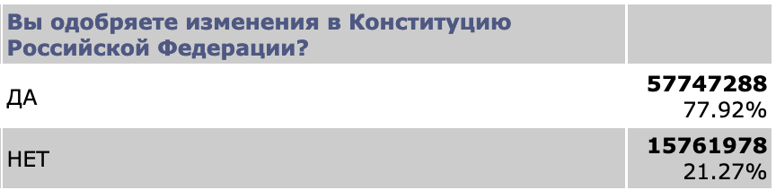

# Результаты референдума о внесении изменений в Конституцию РФ

После голосования по поправкам в Конституцию РФ 1 июля 2020 года, [ЦИК снабдил сайт с результатами капчей](https://meduza.io/news/2020/07/01/na-sayte-tsik-s-yavkoy-i-rezultatami-golosovaniy-poyavilas-kapcha-chtoby-dannye-nelzya-bylo-skachat-avtomaticheski), чтобы сделать автоматический сбор информации невозможным. Нам удалось обойти установленную капчу и собрать всю информацию о голосах и явке по каждому из УИКов, поэтому мы с радостью публикуем эти результате в удобном формате для независимых исследователей.

# Проверка данных

Проверить корректность данных очень просто. Для этого посчитаем сумму голосов по всем УИКам и сравним с [официальными показателями](http://www.vybory.izbirkom.ru/region/region/izbirkom?action=show&root=1&tvd=100100163596969&vrn=100100163596966&region=0&global=1&sub_region=0&prver=0&pronetvd=null&vibid=100100163596969&type=232).

```python
>>> import pandas as pd
>>> dframe = pd.read_csv('votes.csv', header=0)
>>> dframe['yes'].sum()
57747288
>>> dframe['no'].sum()
15761978
```

Действительно, результаты совпадают с результатами ЦИК.


